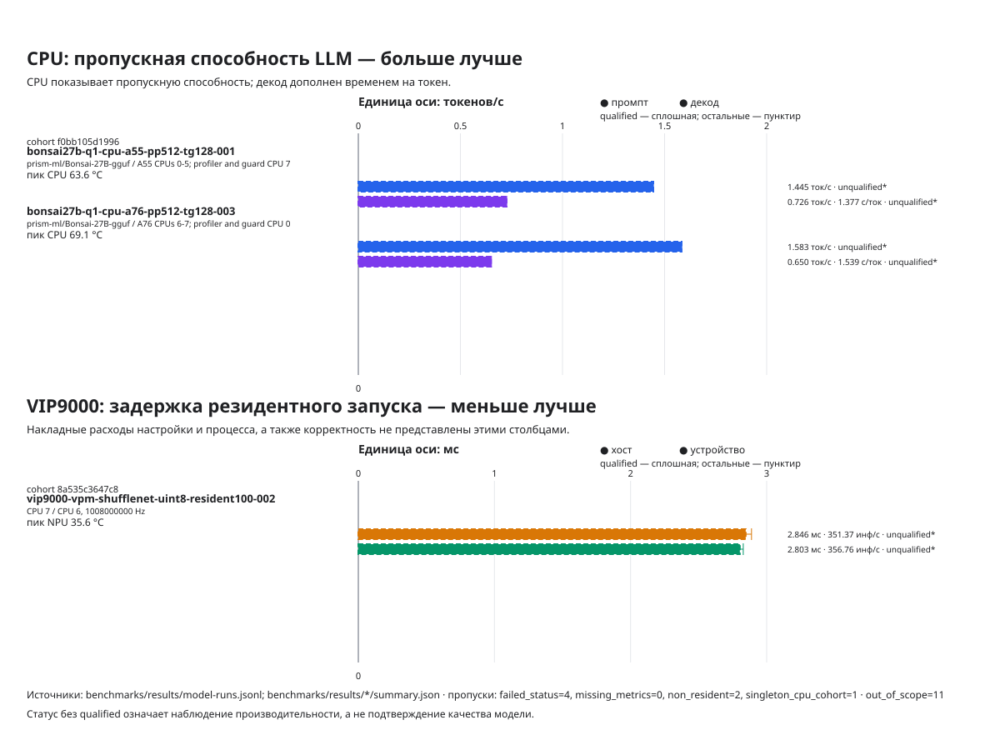

# Bonsai 27B model card

## Source and identity

- Upstream source: [prism-ml/Bonsai-27B-gguf](https://huggingface.co/prism-ml/Bonsai-27B-gguf)
- Model ID: `prism-ml/Bonsai-27B-gguf`
- Current benchmark local filename: `Bonsai-27B-Q1_0.gguf`
- Current benchmark format/quantization: GGML `Q1_0`, type `41`; this is not
  packed `TQ1_0`
- Current benchmark group/block size: `128`
- Current benchmark file size in bytes: `3,803,452,480`
- Current benchmark SHA-256:
  `17ef842e47450caeb8eaa3ebfbbab5d2f2278b62b79be107985fb69a2f819aa0`

The source and target copies were independently hashed and matched. This pins
the artifact identity only; a benchmark row is not valid until the model has
completed the profiling and quality contract.

## Reference and quality policy

The pinned CPU reference uses the exact local model hash, tokenizer, prompt
suite, context, batch, micro-batch, threads/affinity, seed, sampling settings,
and software revision used by a candidate. Generation candidates require
deterministic token agreement against that reference. Format or quantization
changes additionally require a pinned perplexity or task-level evaluation.
Thresholds are declared before a candidate is interpreted; missing quality data
keeps a result `unqualified`, and a failed threshold is `rejected`.

## Наглядный обзор измерений

График строится только из сохранённых evidence. Непроверенный статус означает
наблюдение производительности, а не подтверждение качества модели.

Полная таблица запусков с добавлением новых строк

## Recorded results

Rows are generated by `tooling/record_model_result.py` from the canonical JSONL
ledger. Do not invent rows or results here.

| Date | Run | Experiment | Backend / partition | Quantization | ctx / batch / ubatch / threads | Prompt tok/s | Decode tok/s | TTFT ms | Peak RSS MiB | Quality | Status | Raw |
|---|---|---|---|---|---:|---:|---:|---:|---:|---|---|---|
<!-- MODEL_RESULTS_START -->
| 2026-08-09 | bonsai27b-q1-cpu-a76-pp512-tg128-003 | CPU baseline: isolated A76 pair, pp512/tg128 | cpu / A76 CPUs 6-7; profiler and guard CPU 0 | GGML Q1_0 type 41, group 128 | 512 / 512 / 512 / 2 | 1.583 | 0.650 | — | 7308.6 | deterministic-token-agreement=—; threshold=1; not-run | unqualified | [raw](../results/bonsai27b-q1-cpu-a76-pp512-tg128-003/summary.json) |
| 2026-08-09 | bonsai27b-q1-cpu-a55-pp512-tg128-001 | CPU baseline: isolated A55 cluster, pp512/tg128 | cpu / A55 CPUs 0-5; profiler and guard CPU 7 | GGML Q1_0 type 41, group 128 | 512 / 512 / 512 / 6 | 1.445 | 0.726 | — | 7308.2 | deterministic-token-agreement=—; threshold=1; not-run | unqualified | [raw](../results/bonsai27b-q1-cpu-a55-pp512-tg128-001/summary.json) |
| 2026-08-09 | bonsai27b-q1-cpu-a76-smoke-001 | Initial A76 llama-cli generation smoke | cpu / A76 CPUs 6-7; collectors unpinned | GGML Q1_0 type 41, group 128 | 512 / 512 / 512 / 2 | — | — | — | 7353.7 | deterministic-token-agreement=—; threshold=1; not-run | failed | [raw](../results/bonsai27b-q1-cpu-a76-smoke-001/summary.json) |
| 2026-08-09 | bonsai27b-q1-cpu-a76-smoke-002 | A76 llama-completion bounded generation smoke | cpu / A76 CPUs 6-7; collectors unpinned | GGML Q1_0 type 41, group 128 | 512 / 512 / 512 / 2 | 1.300 | 0.630 | — | 7188.5 | deterministic-token-agreement=—; threshold=1; not-run | unqualified | [raw](../results/bonsai27b-q1-cpu-a76-smoke-002/summary.json) |
| 2026-08-09 | bonsai27b-q1-cpu-a76-pp512-tg128-001 | A76 pp512/tg128 attempt with additive -pg semantics | cpu / A76 CPUs 6-7; collectors unpinned | GGML Q1_0 type 41, group 128 | 512 / 512 / 512 / 2 | — | — | — | 7308.6 | deterministic-token-agreement=—; threshold=1; not-run | failed | [raw](../results/bonsai27b-q1-cpu-a76-pp512-tg128-001/summary.json) |
| 2026-08-09 | bonsai27b-q1-cpu-a76-pp512-tg128-002 | A76 pp512/tg128 attempt with unisolated collectors | cpu / A76 CPUs 6-7; collectors unpinned | GGML Q1_0 type 41, group 128 | 512 / 512 / 512 / 2 | — | — | — | 7308.5 | deterministic-token-agreement=—; threshold=1; not-run | failed | [raw](../results/bonsai27b-q1-cpu-a76-pp512-tg128-002/summary.json) |
<!-- MODEL_RESULTS_END -->

