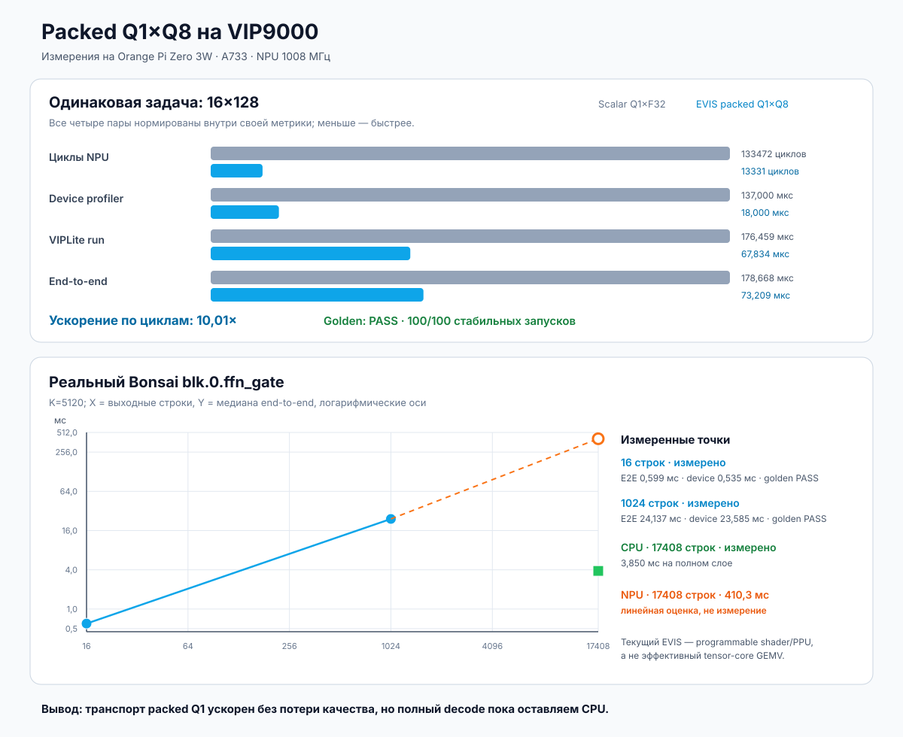

# Packed Q1×Q8 EVIS на VIP9000: реальный Bonsai и граница ускорения

Дата: 2026-08-11. Основной run bundle:
`q1-vip9000-evis-bonsai-20260811`.

## Короткий результат

На Orange Pi Zero 3W впервые собран и выполнен наш собственный EVIS kernel,
который читает Q1_0 weights и Q8_0 activation непосредственно в упакованном
виде. Матрица весов не разворачивается в INT8 в оперативной памяти.

На одинаковой синтетической задаче `16×128` новый kernel требует в `10,01×`
меньше NPU cycles, чем прежний скалярный NPU shader, и в `2,44×` быстрее по
end-to-end. Golden прошёл, 100/100 результатов стабильны.

На реальном `blk.0.ffn_gate` Bonsai математическая точность также прошла, но
масштабирование показало принципиальную границу: programmable EVIS/PPU path
пока намного медленнее оптимизированного CPU Q1 GEMV. Поэтому полноценный
decode не переведён на этот kernel. Следующий кандидат — один fused NBG, где
EVIS только распаковывает маленький tile, а dot product исполняет native
UINT8/I8 tensor operation.



## Что означает EVIS в этом эксперименте

EVIS — это Vivante-расширения программируемого vector/shader пути. В исходнике
они выглядят как `VXC_BitExtract`, `VXC_ReadImage`, `VXC_DP16x1` и uniforms,
которые описывают lane selection и арифметику. VXC compiler переводит `.vx`
в бинарный shader, а OpenVX wrapper пакует его в NBG для VIPLite.

Это всё ещё реальное выполнение на VIP9000, но EVIS kernel не равнозначен
стандартному `FullyConnected` или `Conv`, которые compiler может направить на
native NN MAC array. Наши измерения как раз показывают разницу: удобный
programmable path отлично сокращает старое скалярное ядро, но не достигает
пропускной способности tensor data path на большом GEMV.

## Формат данных и математика

Один Q1_0 block длины `K=128` занимает 18 bytes:

- 2 bytes — little-endian FP16 scale `d1`;
- 16 bytes — 128 знаковых bits, LSB-first;
- bit `1` означает `+d1`, bit `0` — `−d1`.

Соответствующая Q8_0 activation занимает четыре блока по 34 bytes, всего
136 bytes:

- в каждом блоке 2 bytes FP16 scale `d8`;
- затем 32 signed INT8 values.

Kernel не создаёт tensor из 128 значений `−1/+1`. Для каждой группы 16 знаков
`VXC_BitExtract` создаёт только register-local значения `0/1`. Затем два
signed I8 dot/sum primitive используют точное тождество:

```text
Σ(2b − 1)q = 2Σ(bq) − Σq
```

После четырёх Q8 subblocks применяется ровно та же scale-математика, что в CPU
golden:

```text
output[row] = Σ_k d1[row,k] × Σ_subblock d8[k,subblock] × integer_dot
```

Новый формат весов для GGUF здесь не вводился: kernel понимает существующий
canonical Q1_0 carrier. Это важно для качества и исключает повторную
конверсию всей модели.

## Исправленная семантика tensor image output

Ранний вариант запускался, но иногда возвращал нули в случайных строках.
Причина оказалась не в Q1 арифметике: в Vivante tensor image ABI
`write_imagef` записывает `float4`, то есть четыре последовательных FP32
элемента. При схеме «один work-item на одну строку» соседние work-items писали
перекрывающиеся интервалы `[row..row+3]`.

Исправленный kernel назначает одному work-item четыре строки, формирует один
`float4` и делает одну неперекрывающуюся запись. После этого синтетический тест
прошёл 100/100, реальный 16-row тест — 100/100, а 1024-row — 20/20 без одного
repeat mismatch.

## Инструменты и версии

- Target: Orange Pi Zero 3W, Allwinner A733, 12 GiB RAM.
- NPU: Vivante VIP9000, `/dev/vipcore`, clock 1008 MHz.
- VIPLite: `2.0.3.2-AW-2024-08-30`, ABI `0x00020003`.
- CID: `0x1000003b`.
- Compiler container: `ubuntu-npu:v2.0.10.2`.
- IDE: VivanteIDE 5.11.0, VXC 5.0.0.
- Config: `VIP9000NANODI_PID0X1000003B.config`.
- Generic shader: 17 registers, 563 instructions; SHA-256
  `c9a1baff9c35e5e8ca76fc48cdf0603f753b8f41856e36d9c77c7e4ece3f16a1`.
- Source kernel: `experiments/E003-q1-packed-carrier/q1_vip_q8_evis_1x128.vx`.
- Graph builder: `experiments/E003-q1-packed-carrier/vxc_nbg_builder.c`.
- Target profiler: `tooling/profiled_viplite_runner.c`.

Официальные DP16 uniform arrays взяты из I8 path TIM-VX 1.1.30. Семантика
двух `VXC_BitExtract` writes в lanes `0..7` и `8..15` подтверждена vendor
kernel `resize_bilinear_U8_opt.vx`; signed DP16 path —
`instance_normalization_i8.vx` и `instance_normalization_evis.c`.

## Синтетическое A/B на одинаковой форме

Форма обоих вариантов — 16 output rows, `K=128`. Парный back-to-back A/B
использует одни Q1 weights и одну Q8 activation; скалярный вариант получает
точную FP32-деквантизацию того же Q8_0, EVIS — canonical packed Q8_0. Оба
64-byte output побайтно совпали с одним сохранённым CPU golden. Поэтому A/B
показывает совокупный эффект packed activation и vector primitive, а не
изолированную цену одной инструкции.

Scalar NPU Q1×F32, steady median из 99 итераций:

- H2D 1,375 µs;
- device 137 µs;
- cycles 133472;
- wall-clock run 176,459 µs;
- D2H 0,834 µs;
- end-to-end 178,668 µs.

EVIS packed Q1×Q8, steady median из 99 итераций:

- H2D 3,041 µs;
- device 18 µs;
- cycles 13331;
- wall-clock run 67,834 µs;
- D2H 2,291 µs;
- end-to-end 73,209 µs.

Отношение scalar / EVIS:

- cycles: `10,01×`;
- device: `7,61×`;
- run: `2,60×`;
- end-to-end: `2,44×`.

Здесь `golden PASS` означает независимое сравнение output, а не только
совпадение повторных NPU запусков. В result bundle лежат synthetic inputs,
golden, оба outputs и raw logs; `cmp` для scalar и EVIS завершается с кодом 0.

## Реальные тензоры Bonsai

Проверен tensor `blk.0.ffn_gate.weight` формы `17408×5120`, Q1_0. Полный
packed tensor занимает 12 533 760 bytes; SHA-256
`0f42ca3b81099f540ed67941809ee7fdc0a672563bf852b87db75034135fc6fe`.
Весовые бинарники и NBG не публикуются в Git; сохраняются только метрики,
raw-профили и хеши.

### Первые 16 строк, K=5120

- 100 запусков, 99 steady;
- cycles median 530089;
- device median 0,535 ms;
- run median 0,589 ms;
- end-to-end median 0,599 ms;
- 100/100 outputs стабильны;
- NPU против независимого golden: max absolute error `5,96e−8`;
- NPU против штатного CPU output: max absolute error `5,96e−8`.

### Первые 1024 строки, K=5120

- 20 запусков, 19 steady;
- cycles median 23630039;
- H2D median 0,229 ms;
- device median 23,585 ms;
- run median 23,860 ms;
- D2H median 0,046 ms;
- end-to-end median 24,137 ms;
- 20/20 outputs стабильны;
- NPU против независимого golden: max absolute error `1,79e−7`, mean absolute
  error `2,69e−8`;
- CPU против того же golden имеет тот же max absolute error `1,79e−7`.

Большие relative/ULP ошибки около нуля не являются полезной метрикой для этого
output: малое изменение порядка FP32 суммирования может давать большое
относительное число при почти нулевом знаменателе. Абсолютная ошибка показывает,
что NPU находится в том же диапазоне, что и CPU reference.

После теста NPU был 35,154 °C, частота оставалась 1008 MHz, вентилятор — 4/4.
Температурного троттлинга в этом результате нет.

## Почему это пока не ускорение токенов/с

Штатный CPU operator уже измерен на полном том же слое `17408×5120`:
3,8503125 ms median. Один EVIS tile лишь на 1024 строки занимает 24,137459 ms,
то есть в 6,27 раза дольше CPU, который за меньшее время считает весь слой.

Линейная оценка 17 последовательных tiles даёт 410,337 ms, примерно в 106,6
раз хуже измеренного CPU. Это только оценка: compiler не выгрузил полный
17408-row NBG после `graph_io`, поэтому точка на графике нарисована полой и
подписана «не измерение».

Даже устранение текущего H2D weights не исправит порядок величины: device time
одного 1024-row tile равен 23,585 ms. Узкое место теперь не передача carrier,
а вычисление большого dot на programmable shader path.

## Что значат H2D, run, device и D2H здесь

- **H2D** — map, host memcpy, unmap и cache flush двух input buffers в общей
  DDR A733. Это не PCIe и не копия в отдельную видеопамять.
- **run** — wall-clock синхронного `vip_run_network`, включая driver/API и
  ожидание.
- **device** — `VIP_NETWORK_PROP_PROFILING`, сообщённое самим runtime время
  выполнения устройства.
- **D2H** — cache invalidate, map, memcpy и unmap output.
- **golden** — результат, независимо вычисленный CPU reference. Equality с
  первым NPU output проверяет стабильность, но само по себе не является golden.

Runner не содержит CPU-кода операции и не может сам заменить NBG вычислением
на host. Успешный device profiler и ненулевые cycles на каждой итерации являются
сильным доказательством NPU execution. Однако закрытый runtime не предоставляет
нам счётчик внутреннего fallback, поэтому абсолютное утверждение о его
отсутствии не делается.

## Неудачные и полезные находки

- `vxCreateProgramWithBinary` принимает `.clgcSL/.vxgcSL` с magic `SHDR`, но
  не `.gcPGM` с `PRGM`.
- Null callbacks в `vxAddKernelInProgram` приводили к segfault; validator,
  initializer и deinitializer должны быть непустыми.
- `vxVerifyGraph` перед `vxGenerateNBG` падал в vendor stack; builder следует
  рабочему TIM-VX `CompileToBinary` path и сразу генерирует NBG.
- Pointer-buffer ABI приводил к NPU MMU exception; tensor image ABI работает.
- Маленький стандартный Add NBG зависает на 241-м повторе, хотя до 240 работает,
  а крупный ShuffleNet выдерживает 1000. Это отдельная vendor runtime проблема,
  не thermal failure; для tiny probes мы ограничиваем repeat count до 100.
- Полный NBG `17408×5120` останавливался после `phase=graph_io`, тогда как
  1024-row NBG генерируется. Поэтому full NPU latency не выдумывается.

## Следующий CPU+NPU эксперимент

Гибридный путь технически возможен: CPU и NPU могут исполнять разные операции
или разные крупные subgraphs, а boundary tensors передаются через общую память.
Но offload выгоден только когда граница не создаёт больше DDR traffic и driver
overhead, чем экономит NPU.

Следующий gate:

1. EVIS node читает packed Q1 и распаковывает только небольшой tile.
2. Native UINT8/I8 `FullyConnected` или `Conv` node принимает этот tile внутри
   того же graph и использует NN MAC array.
3. NBG workspace и profiler должны доказать, что expanded tile остаётся в
   on-chip SRAM; материализация в DDR означает fail.
4. Q8_0 имеет отдельный FP16 scale на каждые 32 значений. Эти 4×40 scales для
   K=5120 нельзя заменить одним per-tensor scale без отдельного quality gate.
5. Кандидат принимается только если measured full operator latency ниже CPU,
   а независимый golden не ухудшается.

До прохождения этого gate практичная архитектура остаётся гибридной:
Q1 decode GEMV — CPU; NPU — только те native dense/conv или более крупные
resident subgraphs, которые проходят measured latency и quality gate.

## Воспроизводимость

В Git сохраняются:

- машинная сводка:
  `benchmarks/results/q1-vip9000-evis-bonsai-20260811/summary.json`;
- четыре raw VIPLite logs рядом со сводкой;
- генератор графика: `tooling/generate_q1_evis_chart.py`;
- график: `benchmarks/charts/q1-vip9000-evis-bonsai-20260811.svg`;
- kernel и graph builder в `experiments/E003-q1-packed-carrier/`.

График воспроизводится так:

```bash
python3 tooling/generate_q1_evis_chart.py \
  benchmarks/results/q1-vip9000-evis-bonsai-20260811/summary.json \
  --output benchmarks/charts/q1-vip9000-evis-bonsai-20260811.svg
```

Генератор отказывается перезаписывать существующий файл и не разрешает
обозначить линейную проекцию как измерение.
