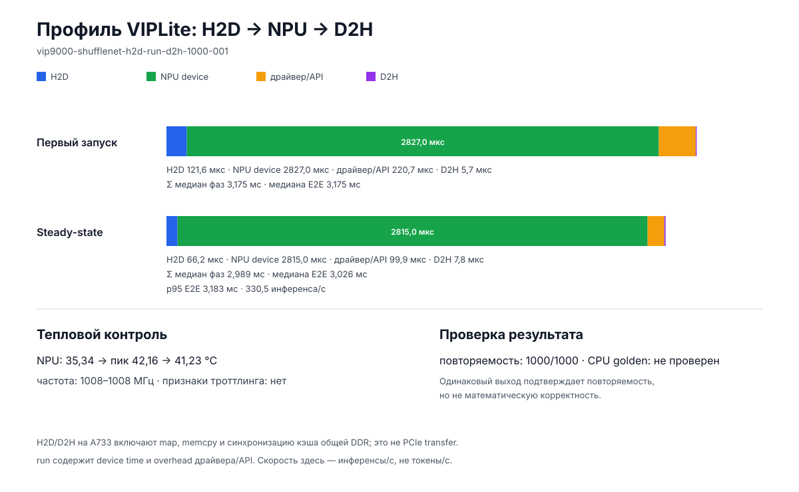

# Реальный фазовый профиль VIP9000: H2D → run → D2H

Дата прогона: 2026-08-10. Run ID:
`vip9000-shufflenet-h2d-run-d2h-1000-001`.

Это первый в репозитории прогон, где один resident NBG на реальном VIP9000
измерен не только общим временем вызова, но и разложен на подготовку входа,
внутреннее время устройства, overhead API/драйвера и чтение выхода.

Для общего сравнения экспериментов используйте
[XY-карту](../../benchmarks/charts/experiment-xy-overview.svg). Она отдельно
показывает full-model tokens/s Bonsai, служебный NPU inference ShuffleNet и
CPU golden Q1. На расположенном ниже фазовом графике токенов нет.

## Что именно проверено

- Целевая плата: AArch64 Allwinner A733, 12 GiB RAM, `/dev/vipcore`.
- VIPLite: `2.0.3.2-AW-2024-08-30`, driver ABI `0x00020003`.
- NPU CID: `0x1000003b`; runtime видит одно устройство и один логический core.
  Это число не следует автоматически интерпретировать как количество
  физических NN engines внутри VIP9000.
- Сеть: известный рабочий ShuffleNetV2 UINT8 NBG; вход `224×224×3×1`,
  `150528` bytes; выход `2×1`, `2` bytes.
- Сеть, buffers и привязка I/O создавались один раз, затем переиспользовались
  для 1000 запусков. Такой режим называется **resident**.
- Все 1000 запусков завершились успешно. Ошибок внутреннего NPU profiler нет;
  несовпадений результата с первым запуском нет.
- NPU всё время сообщал 1008 MHz. Температура NPU: 35,34 °C в начале,
  42,16 °C максимум и 41,23 °C в конце. Вентилятор оставался на состоянии 4/4,
  NPU cooling state — 0. Признаков thermal throttling в доступных данных нет.

Это **не** тест Bonsai и не измерение tokens/s. ShuffleNet нужен как уже
совместимый NBG-зонд, чтобы проверить сам путь VIPLite и стоимость его фаз до
появления исправного host compiler для нашего Q1 graph.

## Термины и границы таймингов

**H2D (host to device)** — путь от CPU-visible input до состояния, в котором
NPU может безопасно его читать. В runner это
`map → memcpy → unmap → cache flush`. На A733 CPU и NPU используют общую DDR;
это не PCIe-копия в отдельную видеопамять. Однако владение кэш-линиями,
синхронизация и проход по DDR имеют реальную цену.

**run** — wall-clock вокруг синхронного `vip_run_network()`. Он содержит
внутреннее выполнение NPU и overhead входа в runtime/driver, ожидание и
синхронизацию.

**device** — `inference_time`, который возвращает
`VIP_NETWORK_PROP_PROFILING`. Это время, сообщённое самим Vivante runtime для
устройства; оно не включает весь end-to-end путь приложения.

**D2H (device to host)** — подготовка результата NPU к безопасному чтению CPU.
В runner это `cache invalidate → map → memcpy → unmap`. Текущий output равен
всего двум байтам, поэтому вычислять для D2H «пропускную способность» почти
бессмысленно: фиксированная цена API значительно больше самой копии.

**first** — первая итерация после `prepare`. Она ещё затрагивает холодные кэши
и ленивую инициализацию runtime.

**steady-state** — последующие итерации уже подготовленного resident graph.
Именно этот режим важен для многократного autoregressive inference.

**golden** — эталонный output, независимо вычисленный другим путём, в нашем
случае CPU reference. Сравнение следующих NPU outputs с первым подтверждает
повторяемость, но не математическую правильность: одна и та же ошибка тоже
может повторяться 1000 раз.

## Результат 1000 итераций

Первая итерация:

- H2D: 121,584 µs;
- wall-clock `run`: 3047,666 µs;
- device: 2827 µs;
- `run − device`: 220,666 µs;
- D2H: 5,667 µs;
- полный H2D + run + D2H: 3174,917 µs.

Steady-state, 999 итераций:

- H2D: min 38,083; median 66,250; p95 121,379; max 160,958 µs;
- wall-clock `run`: min 2827,709; median 2918,750; p95 3058,988;
  max 3699,250 µs;
- device: min 2782; median 2815; p95 2907; max 3045 µs;
- `run − device`: min 35; median 99,875; p95 211,087; max 864 µs;
- D2H: min 1,292; median 7,834; p95 15,170; max 71,125 µs;
- end-to-end: min 2870,833; median 3025,668; p95 3182,788;
  max 3793,167 µs;
- `end-to-end − device`: median 181,751 µs.

Медиана end-to-end соответствует примерно **330,5 inference/s**. Это не
tokens/s: один inference этой сети не равен одному токену LLM.

Сумма отдельных медиан не обязана совпадать с медианой суммы. Поэтому график
показывает оба числа: `Σ median(phase) = 2,993 ms`, а реальная
`median(H2D + run + D2H) = 3,026 ms`.

Для входа 150528 bytes медианный H2D даёт 2,272 GB/s эффективной скорости.
Это полезная end-to-end метрика данного API path, но не чистая пропускная
способность DDR: в число входят map/unmap и cache maintenance.

## Проверка выхода

Raw output равен `[0, 255]`. NBG сообщает TF-asymmetric параметры
`scale=0.00162548793`, `zero_point=128`, поэтому деквантованные значения равны
примерно `[-0.208062455, 0.206436967]`. Они согласуются с текстовым output
штатного Vivante runner.

Статус результата остаётся `performance-observed-unqualified`:

- `repeat_equal_failures = 0` подтверждает детерминированность;
- независимого CPU golden для этой закрытой ShuffleNet fixture нет;
- следовательно, этот запуск нельзя использовать как доказательство качества
  модели или правильности произвольного NBG.

Для E003 Q1 golden уже определён: 16 little-endian FP32, ровно 64 bytes из
`expected_f32.bin`. Там PASS потребует сравнить каждый элемент с независимым
CPU reference и не разрешать CPU fallback.

## Где сейчас теряется время

Сам NPU занимает основную часть resident итерации, но медианный внешний
overhead `end-to-end − device` равен 181,751 µs. Для будущей LLM partition это
означает:

1. не возвращать промежуточный tensor на CPU после каждого op;
2. компилировать более крупный resident subgraph, если это не раздувает
   промежуточные UINT8 buffers и DDR traffic;
3. хранить packed Q1 weights резидентно и передавать через UINT8 carrier без
   распаковки всего слоя на host;
4. отдельно сравнить normal buffers, импорт/zero-copy и batched dispatch;
5. измерять profiler overhead контрольным прогоном с менее частой телеметрией.

Рост хвостовых H2D/run/D2H значений не сопровождается снижением NPU clock или
активацией cooling. Поэтому считать его температурным троттлингом оснований
нет; следующая A/B проверка должна отделить scheduler/context-switch и
10-миллисекундную телеметрию от runtime/driver variance.

## Исторический host compiler blocker E003

Контролируемые попытки собрать минимальный TIM-VX Add и затем Q1 C0 выявили
несогласованность локального `acuitylite:ready`:

- AcuityLite сообщает 6.51.0;
- embedded VSI NN headers сообщают 1.2.30, а часть generated graph кода ожидает
  TIM-VX 1.1.30;
- embedded `libtim-vx.so` вызывает `vxQueryHardwareCaps` с legacy struct sizes
  28/36, а находящийся рядом OpenVX принимает 20/32/40;
- ABI shim убирает первоначальный status `-10`, но compiler падает позже при
  создании Add node;
- пересобранный открытый TIM-VX 1.1.30 доходит до VXC, после чего этот же
  bundle падает и для default profile, и для
  `VIP9000NANODI_PLUS_PID0X1000003B`.

На дату этого отчёта это был host-toolchain blocker, а не отрицательный
результат VIP9000; повреждённый NBG на плату не отправлялся. Блокер позже
обойдён согласованным Vivante IDE/VXC bundle и прямым OpenVX graph builder.
Реальный packed Q1_0×Q8_0 E003 собран, запущен и проверен 2026-08-11; актуальные
результаты находятся в
[отчёте E003](q1-vip9000-evis-bonsai-2026-08-11.md).

## Воспроизводимость и артефакты

В Git сохранены:

- фазовый runner: `tooling/profiled_viplite_runner.c`;
- строгий parser: `tooling/summarize_viplite_profile.py`;
- генератор SVG: `tooling/generate_viplite_phase_chart.py`;
- компактная сводка:
  `benchmarks/results/vip9000-shufflenet-h2d-run-d2h-1000-001/summary.json`;
- график: `benchmarks/charts/vip9000-shufflenet-phase-profile.svg`.

Runner source SHA-256:
`a98258aea1bd76d888cb58aaa6683cc2994f9d34c8aa6084c2da38c6ec5dd83b`.
Собранный на A733 executable SHA-256:
`5552791941f4636eb8f812184465ae785488916ac3fe6c9e8152102fb11a669d`.

Raw bundle остаётся вне Git. Его опубликованные SHA-256:

- `stdout.log`: `e038a5ed8781129a6c1c18ac79fbd2033a56274a6ebdc0e8cdd610a5201e5277`;
- `stderr.log`: `e3b0c44298fc1c149afbf4c8996fb92427ae41e4649b934ca495991b7852b855`;
- `telemetry.jsonl`: `5f2993d712877147ff8df01e9220413338bfb53df6d6ddece3cf83bb8a907e31`;
- `thermal-guard.jsonl`: `89d379f1c55a8ab1804324f71e9e5f478d74dea7f75c7301b18e05254086bf07`;
- `phases.jsonl`: `f8b759414d387c46c0a1ca831f607363a170e57f6a7dbd620937cc4a89fe7a19`;
- `output.bin`: `06eb7d6a69ee19e5fbdf86c5712c5805b84c99e5fd3fa80d93d5e1918c542293`.

Сохранение только компактной сводки и хешей не публикует vendor NBG,
runtime binaries или закрытые SDK assets.
