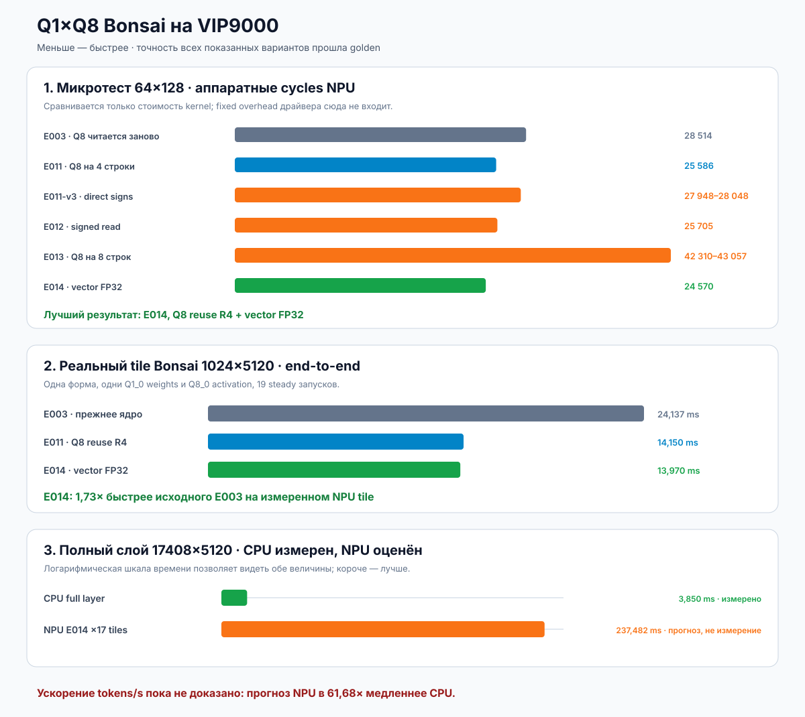

# Переиспользование Q8 в бинарном ядре Bonsai на VIP9000

Дата: 2026-08-11. Run bundle:
`vip9000-q1-q8-row-reuse-20260811-001`.

## Короткий результат

Собрано точное EVIS-ядро, которое загружает один фрагмент Q8 activation и
использует его сразу для четырёх строк бинарных Q1_0 weights. Дополнительная
векторизация четырёх FP32 accumulators дала новый лучший вариант E014. На
реальном tile `1024×5120` слоя `blk.0.ffn_gate` Bonsai он ускорил исходное
NPU-вычисление в `1,75×` по аппаратным cycles и в `1,73×` по end-to-end времени. Результат побайтно
совпал с предыдущим точным NPU-ядром; максимальная абсолютная ошибка против
независимого CPU golden осталась `1,79e-7`.

Это настоящее ускорение нашего NPU kernel, но пока не ускорение всей модели.
Новый NPU tile занимает `13,970 ms`, тогда как CPU считает полный слой из
17 таких диапазонов за `3,850 ms`. Линейная NPU-оценка полного слоя —
`237,482 ms`, то есть примерно в `61,68×` медленнее измеренного CPU operator.
Поэтому в `llama.cpp` этот offload пока не включается.



## Что именно изменено

Одна **строка** — это веса одного выходного нейрона. Для неё надо вычислить
скалярное произведение всех Q1-весов на один общий Q8-вектор activation.

Старое E003-ядро одним `work-item` считало четыре строки, но внутри каждой
строки заново читало те же Q8 chunks. Новый E011-v2 меняет порядок циклов:

1. читает четыре packed Q1 sign blobs;
2. читает один 16-byte Q8 chunk;
3. один раз считает сумму его signed INT8 элементов;
4. применяет тот же Q8 chunk к четырём строкам Q1;
5. повторяет это для восьми chunks одного K=128 block;
6. записывает четыре FP32 результата одним `float4`.

`Work-item` — один экземпляр EVIS-программы на VIP9000. В принятом варианте
он считает четыре output rows. Незакодированные значения `−1/+1` существуют
только во внутренних регистрах NPU: expanded INT8 tensor в DDR не создаётся.

## Почему математика точная

Q1_0 хранит один знак одним битом `b`: `0` означает `−1`, `1` — `+1`.
Kernel извлекает `0/1` и использует целочисленное тождество:

```text
Σ(2b − 1)q = 2Σ(bq) − Σq
```

Первая сумма зависит от строки весов; вторая зависит только от Q8 chunk и
поэтому безопасно переиспользуется для четырёх строк. FP16 scales Q1_0 и Q8_0
читаются из исходных canonical blocks. Новый формат GGUF и повторная
квантизация не вводятся, поэтому качество модели не меняется.

`Golden` — независимый CPU-расчёт той же операции. Совпадение между повторными
NPU-запусками доказывает стабильность, но точность доказывает именно сравнение
с golden.

## Синтетический тест 64×128

Здесь все варианты решают одну и ту же маленькую задачу и выдают один
побайтно совпадающий FP32 output с SHA-256
`8417deaa3388290678a4659bce7fd694805f0f489c7692327a1fb0deacf2be89`.

- E003, повторное чтение Q8 для каждой строки: `28 514` cycles, `35 µs`
  device, `74,041 µs` end-to-end.
- E011-v2, Q8 разделён между четырьмя строками: `25 586` cycles, `33 µs`
  device, `74,376 µs` end-to-end, 99 steady итераций.
- E011-v3, прямое превращение `0/1 → −1/+1`: `27 948–28 048` cycles. Точный,
  но отклонён как более медленный.
- E012, прямой signed Q8 read без явного `COPY`: `25 705` cycles, `33 µs`
  device, `74,291 µs` end-to-end, 99/99 steady стабильны. Разница с E011-v2
  находится в шуме; отдельный `COPY` не был bottleneck.
- E013, один Q8 chunk на восемь строк: `42 310–43 057` cycles и `48–50 µs`
  device. Точный, но отклонён как более медленный. Увеличенный live state и
  register pressure — вероятное объяснение, а не доказанный факт: vendor
  compiler не выдал resource/spill report, и smoke содержит 2 steady запуска.
- E014, R4 и один `float4` FP32 accumulator: `24 570` cycles, `29 µs` device,
  `74,250 µs` end-to-end, 99/99 steady стабильны. Это на `4,0%` меньше cycles,
  чем E011; вариант принят как новый лучший EVIS kernel.

На маленькой форме E011-v2 снижает аппаратную работу примерно на `10,27%`, но
полное время почти не меняется: fixed overhead вызова VIPLite сопоставим с
самим коротким kernel. Именно поэтому на графике device/cycles и E2E показаны
раздельно.

## Реальный tile Bonsai 1024×5120

Baseline E003, 19 steady итераций:

- device cycles: `23 630 039`;
- device: `23,585 ms`;
- VIPLite run: `23,860 ms`;
- end-to-end: `24,137 ms`.

E011-v2 с четырьмя переиспользующими Q8 строками, 19 steady итераций:

- H2D: `0,228 ms`;
- device cycles: `13 578 831`;
- device: `13,650 ms`;
- VIPLite run: `13,876 ms`;
- D2H: `0,046 ms`;
- end-to-end: `14,150 ms`;
- 19/19 outputs стабильны;
- max absolute error против CPU golden: `1,79e-7`;
- max absolute difference против E003 output: `0`.

Полученное ускорение E003 / E011-v2:

- cycles: `1,74×`;
- device time: `1,73×`;
- run: `1,72×`;
- end-to-end: `1,71×`.

E014 с тем же R4 transport и векторным FP32 accumulation, 19 steady итераций:

- H2D: `0,197 ms`;
- device cycles: `13 473 791`;
- device: `13,545 ms`;
- VIPLite run: `13,754 ms`;
- D2H: `0,015 ms`;
- end-to-end: `13,970 ms`;
- 19/19 outputs стабильны;
- output побайтно совпадает с E011 и E003.

E014 дополнительно ускоряет E011 примерно в `1,013×` по end-to-end и `1,008×`
по cycles. Совокупное ускорение относительно исходного E003: `1,75×` по cycles
и `1,73×` по end-to-end.

## Что значат H2D, run, device и D2H

- **H2D** (`host to device`) — подготовка и cache flush input buffers из CPU
  в общую DDR. На A733 это не PCIe-копия в отдельную видеопамять.
- **run** — полное wall-clock время синхронного `vip_run_network`: драйвер,
  постановка задачи и ожидание завершения.
- **device** — время, сообщённое внутренним профайлером VIP9000.
- **cycles** — аппаратные такты NPU; они лучше всего показывают изменение
  стоимости самого kernel.
- **D2H** (`device to host`) — cache invalidate и чтение output обратно CPU.
- **end-to-end** — `H2D + run + D2H`, то есть наблюдаемая latency вызова.

## Температура и частота

Во время тестов NPU работал на `1008 MHz`, температура оставалась примерно
`31–37 °C`. Thermal throttling не обнаружен. Ранее замеченный скачок wall-clock
времени одного парного теста не был DVFS: governor был `performance`, текущая и
целевая частоты оставались `1008 MHz`, переходов частоты не зафиксировано.

## Практический вывод для Bonsai

Подтверждён полезный принцип: Q8 activation надо читать максимально редко и
использовать для нескольких Q1 rows, пока дополнительные live values не
перевешивают экономию чтений. Среди измеренных R4/R8 вариантов R4 быстрее;
универсальная аппаратная граница регистров этим тестом не доказана.

Векторизация накопления дала ещё `1,3%` на реальном tile, но показала новую
границу: основная стоимость осталась в `BitExtract` и `DP16`, а не в FP32
accumulator. `BitExtract` извлекает отдельные знаковые биты из packed Q1;
`DP16` выполняет dot product шестнадцати INT8 lanes.

Однако `tokens/s` определяет не процент ускорения одного медленного NPU tile, а
время полного decode graph. До интеграции в `llama.cpp` кандидат должен
обогнать CPU на полном operator end-to-end. Текущий E014 этого gate не
проходит, поэтому следующий шаг — уменьшать стоимость BitExtract/DP16 при R4
и продолжать поиск native tensor path, где dot product выполняется не
programmable EVIS, а специализированным MAC-массивом NPU.

## Воспроизводимость

В Git сохраняются исходники принятых и отклонённых вариантов, builder,
source-contract tests, эта русская сводка и machine-readable JSON. NBG и
модельные веса не публикуются; вместо них фиксируются SHA-256.

- Принятое ядро:
  `experiments/E003-q1-packed-carrier/q1_vip_q8_evis_4row_reuse.vx`.
- Отклонённое direct-signs ядро:
  `experiments/E003-q1-packed-carrier/q1_vip_q8_evis_4row_direct_signs.vx`.
- Отклонённый direct signed-read:
  `experiments/E003-q1-packed-carrier/q1_vip_q8_evis_4row_signed_read.vx`.
- Отклонённое R8-ядро:
  `experiments/E003-q1-packed-carrier/q1_vip_q8_evis_8row_reuse.vx`.
- Новое лучшее E014-ядро:
  `experiments/E003-q1-packed-carrier/q1_vip_q8_evis_4row_vector_accum.vx`.
- Машинная сводка:
  `benchmarks/results/vip9000-q1-q8-row-reuse-20260811-001/summary.json`.
