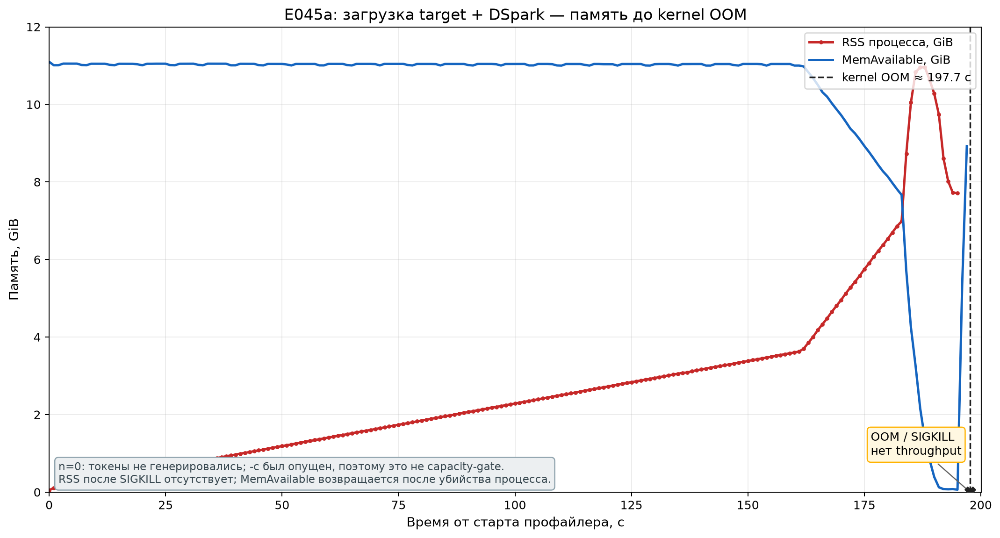
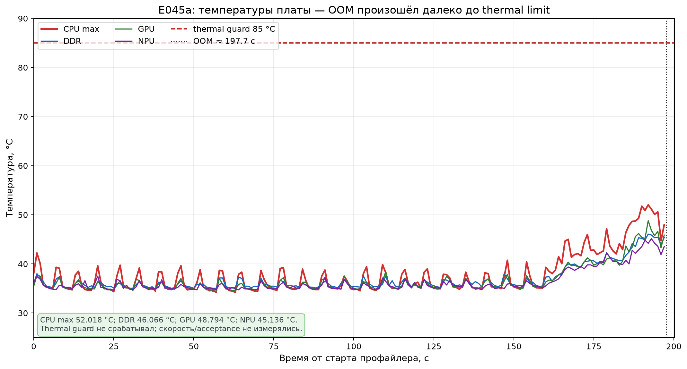
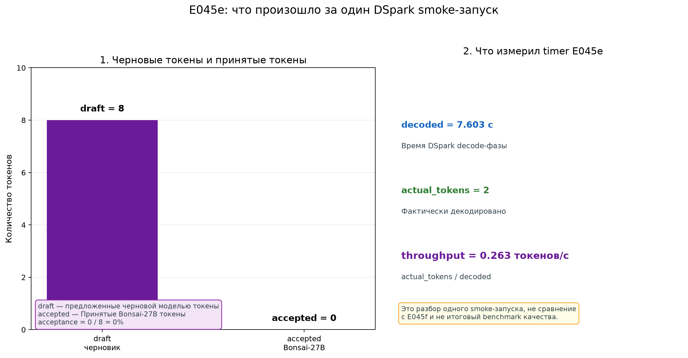
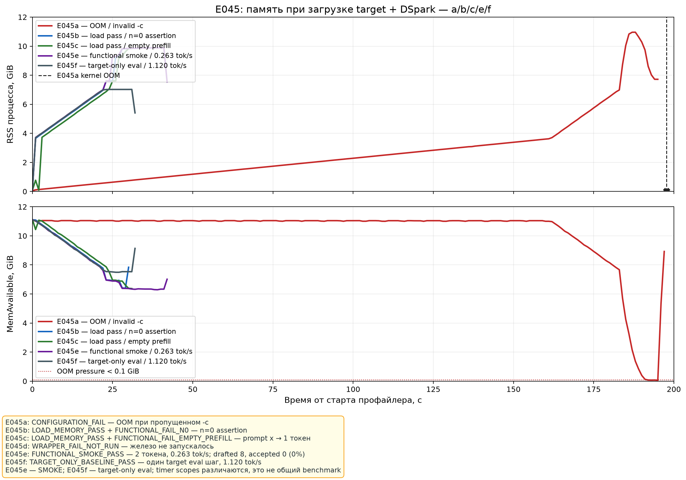
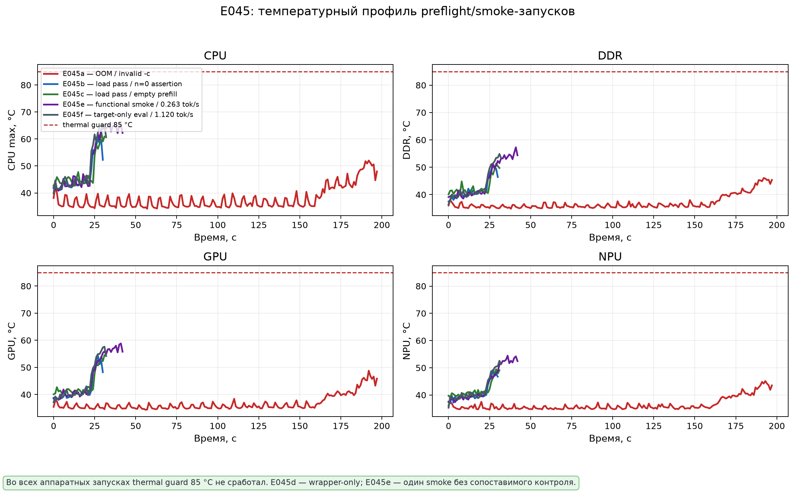
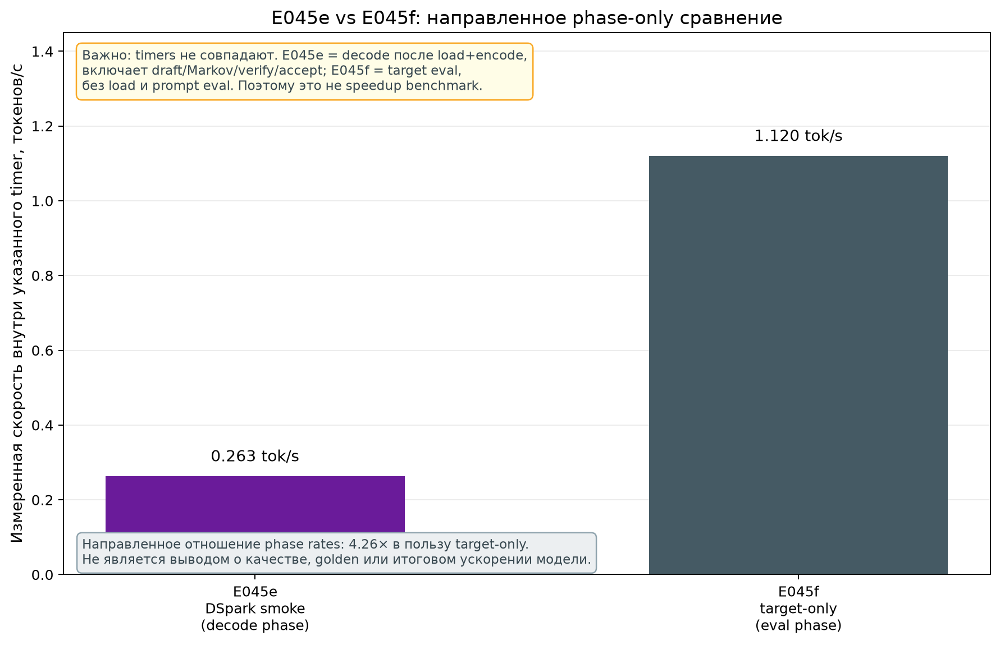

# E045 — DSpark: bounded preflight и функциональный smoke

Дата: 2026-08-13 (UTC)
Плата: Orange Pi Zero 3W / Allwinner A733, `aarch64`, Linux `6.6.98-sun60iw2`
Режим: CPU-only, без E044 PRFM, thermal guard `85 °C`
Целевые модели: Bonsai-27B-Q1_0 + официальный Bonsai-27B-dspark-Q4_1

## Короткий итог

Это серия **preflight/smoke**, а не полноценный benchmark. E045a/b/c не дали
валидной генерации; E045d оказался ошибкой обвязки и железо не запускал. E045e
впервые завершил функциональный smoke и дал одну измеренную точку `0.263 tok/s`;
E045f добавил короткий target-only контроль. Golden и повторов пока нет, а
область timer у двух драйверов различается. Эти точки нельзя выдавать за итоговую
скорость Bonsai-27B.

| Запуск | Конфигурация | Что доказано | Точный статус |
|---|---|---|---|
| **E045a** | контекст `-c` пропущен, `n=0` | kernel OOM при model context `262144`; конфигурация невалидна для capacity-gate | `CONFIGURATION_FAIL` |
| **E045b** | `-c 512`, `n=0` | target и draft загрузились, запас памяти остался; затем неподдержанный `n=0` вызвал `SIGABRT` | `LOAD_MEMORY_PASS + FUNCTIONAL_FAIL_N0` |
| **E045c** | `-c 512`, `n=1`, prompt `x` | target и draft загрузились, запас памяти остался; `x` стал одним BPE-токеном, capture-prefill оказался пустым | `LOAD_MEMORY_PASS + FUNCTIONAL_FAIL_EMPTY_PREFILL` |
| **E045d** | длинный prompt, `-c 512`, `n=1` | `profile_command` отказал из-за заранее созданного каталога; llama.cpp не запускался | `WRAPPER_FAIL_NOT_RUN` |
| **E045e** | тот же длинный prompt, `-c 512`, `n=1` | функциональный DSpark smoke: 2 фактических токена, 8 предложено, 0 принято | `FUNCTIONAL_SMOKE_PASS` |
| **E045f** | target-only, тот же prompt, `-c 512`, `n=2` | один target eval шаг: `1.12 tok/s`; видимый prefix `<think>`, без token IDs | `TARGET_ONLY_BASELINE_PASS` |

Главный практический вывод: явный `-c 512` устранил наблюдавшийся в E045a OOM
при загрузке двух моделей. E045e подтвердил, что host-side capture-prefill
может пройти на длинном prompt; однако acceptance оказался `0%`. Короткий
phase-only контроль E045f показывает неблагоприятное направление, но ещё не
заменяет interleaved benchmark с одинаковыми timers и golden.

## Что именно означает DSpark

DSpark — специальный draft-путь для Bonsai-27B. Небольшой draft-модуль
предлагает блок следующих токенов, а target-модель проверяет их одним проходом.
Если target принимает предложения, одна дорогая проверка может породить
несколько токенов. В E045e механизм дошёл до draft/Markov/verify/accept, но все
8 предложенных токенов были отклонены (`n_accept=0`).

`RSS` — объём страниц процесса, фактически находящихся в RAM.
`MemAvailable` — оценка ядра, сколько памяти ещё можно выдать без немедленного
OOM.
`SIGABRT`/`rc=134` — процесс сам завершился через `abort` после `GGML_ASSERT`,
это не kernel OOM.
`SIGKILL`/`rc=137` — в E045a процесс был убит kernel OOM killer.

## E045a: некорректный полный контекст

В команде не было `-c`. Для этой сборки llama.cpp `n_ctx=0` означает взять
контекст модели, а Bonsai-27B объявляет `262144`. Таким образом, запуск
одновременно создавал огромный KV-cache и загружал target+draft; это невалидный
тест того, помещается ли DSpark в 12 GiB.

Факты из профиля:

| Метрика | Значение |
|---|---:|
| Exit code | `137` (`SIGKILL`) |
| Время до OOM marker | `≈197.7 s` |
| Max RSS | `10.959030 GiB` |
| Min `MemAvailable` | `0.064709 GiB` |
| Max CPU | `52.018 °C` |
| Thermal abort | нет |

Kernel evidence на плате: `global_oom`, затем `Out of memory: Killed process
14649 (llama-speculati)`. Причину нельзя приписывать только Markov-head или
KV-cache: конкретный вклад аллокаций этим запуском не разделён.





## E045b: `-c 512`, но `n=0` не поддержан этим driver path

Обе модели загрузились, DSpark path создался, пять target tap-слоёв подключились.
Пиковые значения показали большой запас памяти. После этого CLI попытался
сделать `decode` с нулем токенов:

```text
E decode: n_tokens == 0
E llama_decode: failed to decode, ret = -1
W draft: seq 0 has no new context rows staged ...
GGML_ASSERT(impl) failed
```

Это `SIGABRT` (`rc=134`, signal 6), не OOM и не thermal abort. В рамках
протокола `n=1` после такого неподдержанного `n=0` отдельно не запускался.

| Метрика | Значение |
|---|---:|
| Профиль | `30.526 s`, 282 telemetry samples |
| Max RSS | `9.824123 GiB` |
| Min `MemAvailable` | `6.390690 GiB` |
| Max CPU | `60.140 °C` |
| Max DDR / GPU / NPU | `51.336 / 54.374 / 49.228 °C` |
| Thermal abort | нет |

## E045c: `n=1`, но prompt `x` оставил пустой prefill

Попытка с `-n 1 -p x` была сделана после успешного bounded load. Причина
ошибки выяснена по host-коду и tokenizer metadata, без повторного запуска:

1. В target tokenizer `x` — один BPE-токен; BOS автоматически не добавляется.
2. `speculative-simple` отделяет последний токен для следующего шага.
3. Остаётся пустой `prompt_tgt`, то есть `n_past=0`.
4. Capture-prefill вызывает `llama_decode` с `n_tokens == 0`.
5. Drafter не получает staged rows и позднее доходит до `GGML_ASSERT(impl)`.

Это ошибка предусловия smoke/robustness driver, а не несовместимость весов с
NPU. Следующий безопасный prompt должен содержать минимум два BPE-токена,
например `hello world`.

| Метрика | Значение |
|---|---:|
| Запрос | `-c 512 -n 1 -p x` |
| Профиль | 297 telemetry samples, около `32 s` |
| Max RSS | `9.841137 GiB` |
| Min `MemAvailable` | `6.372032 GiB` |
| Max CPU | `62.868 °C` |
| Max DDR / GPU / NPU | `51.336 / 54.498 / 49.476 °C` |
| Exit code | `134` (`SIGABRT`) |
| Thermal abort | нет |

Граница `n_predict` тоже требует отдельной проверки: в текущем
`speculative-simple.cpp` условие цикла допускает лишнюю итерацию при `-n 1`.
Это host-side robustness issue и не является измерением качества/скорости.

## E045d: wrapper failure, железо не запускалось

Попытка с длинным prompt была методологически остановлена до запуска модели.
`profile_command.py` увидел заранее созданный каталог `profile/` и корректно
отказался его перезаписывать:

```text
refusing to overwrite existing output directory: .../e045d.../profile
```

Exit code wrapper — `2`, stdout драйвера пуст, активных llama-процессов не было.
Это не аппаратный результат, не ошибка DSpark и не данные скорости; E045d
помечен `WRAPPER_FAIL_NOT_RUN`, а не `FUNCTIONAL_FAIL`.

## E045e: первый функциональный DSpark smoke

Для E045e использован новый каталог профайлера и длинный prompt:

```text
Explain the A733 memory bottleneck in one short sentence.
```

Условия: `-c 512`, `-n 1`, `--spec-type draft-dspark`, `--spec-draft-n-max 4`,
CPU-only, 8 потоков target/draft, `temperature=0`, seed `123`, KV F16, mmap,
thermal guard `85 °C`. Prompt закодировался в 14 токенов. Из-за ранее
зафиксированной границы цикла запрос `n=1` фактически учёл 2 токена; это тоже
нужно исправить до итогового benchmark.

Наблюдаемый результат:

| Метрика | Значение |
|---|---:|
| Exit code | `0` |
| Фактически декодировано | `2` токена |
| `decoded` timer | `7.603 s` |
| Decode speed | `0.263 tok/s` |
| `n_drafted` | `8` |
| `n_accept` / acceptance | `0` / `0%` |
| Max RSS | `9.885788 GiB` |
| Min `MemAvailable` | `6.290817 GiB` |
| Max CPU / DDR / GPU / NPU | `65.224 / 57.288 / 58.838 / 54.436 °C` |
| Thermal abort | нет |

Важно: `7.603 s` — это timer декодирования после загрузки моделей и prompt
encode. Он **не включает** загрузку/инициализацию и prompt encode; включает
работу draft/Markov, verify и accept. Поэтому его нельзя сравнивать с полным
wall-clock или с E035/E044 без одинакового определения интервала.

E045e — только `SMOKE_NOT_FULL_BENCHMARK`: golden/качество не проверялись,
повторов нет, а последующий E045f использует timer с другой семантикой. `0% acceptance`
означает, что draft предложил 8 токенов, но target не принял ни одного; это
сейчас указывает на отсутствие выигрыша в данном smoke, но не является
статистически устойчивым выводом о DSpark без повторов и baseline.



На этом графике нет фиктивной второй серии: слева сопоставлены только две
величины **одного** запуска — `draft = 8` предложений и `accepted = 0` токенов,
принятых Bonsai-27B. Справа явно указаны `decoded = 7.603 с`,
`actual_tokens = 2` и вычисленный `throughput = 0.263 токенов/с`. Это
диагностика внутреннего результата E045e; скорость не сравнивается с E045f,
поскольку у запусков разные области timer.

## График сравнения памяти и температуры

На общем графике RSS и `MemAvailable` показаны для пяти аппаратных
запусков: E045a/b/c/e/f. E045d намеренно отсутствует на memory-графике, потому что
модель не запускалась. E045a длиннее, потому что kernel OOM занял почти 198
секунд; E045b/c/e завершились вскоре после загрузки и функционального шага.
Подписи статусов на графике — часть данных эксперимента, а не baseline или
оценка итогового throughput.





## Диагностическое сравнение E045e и E045f

E045f — target-only baseline на том же prompt и с теми же `-c 512`, CPU-only,
temperature/seed и числом потоков. Его `llama common_perf_print eval` сообщил
`1.12 tok/s` за `0.8964 s` для одного eval run. Видимый prefix stdout обоих
запусков начинается с `<think>`, но token IDs и полный golden output в этих
артефактах не сохранены, поэтому exact-quality claim невозможен.

Сравнивать `1.12 / 0.263 ≈ 4.25×` как настоящий speedup нельзя: E045e измеряет
speculative **decode phase** (после load и prompt encode, включая
draft/Markov/verify/accept), а E045f — target-only **eval phase** (без load и
prompt eval). Это полезная диагностическая разница: в данном smoke DSpark
получил `0%` acceptance и не показал выигрыша, но для итогового вывода нужны
одинаковые timers, несколько повторов, baseline и golden.



## Данные и воспроизводимость

В репозитории сохранены компактные нормализованные данные с агрегацией по одной
секунде. Raw telemetry остаётся на eMMC платы; его SHA и пути указаны в
provenance исходных отчётов.

* [memory_thermal_1s.csv](data/memory_thermal_1s.csv) — E045a;
* [memory_thermal_b_1s.csv](data/memory_thermal_b_1s.csv) — E045b;
* [memory_thermal_c_1s.csv](data/memory_thermal_c_1s.csv) — E045c;
* [memory_thermal_e_1s.csv](data/memory_thermal_e_1s.csv) — E045e;
* [memory_thermal_f_1s.csv](data/memory_thermal_f_1s.csv) — E045f;
* [speculation_smoke.csv](data/speculation_smoke.csv) — единственная smoke-точка E045e;
* [speculation_comparison.csv](data/speculation_comparison.csv) — E045e/E045f с явным scope timers;
* [metrics.json](data/metrics.json) — статусы, memory/thermal summaries и scope без fake baseline;
* [manifest.json](data/manifest.json) — provenance и схема последовательности;
* [plot_e045.py](plot_e045.py) — проверка и генерация графиков;
* [test_plot_e045.py](test_plot_e045.py) — регрессионные тесты схемы, статусов и детерминизма.

Проверка:

```bash
MPLCONFIGDIR=/tmp/e045-mpl python3 experiments/E045-dspark-stock-oom/plot_e045.py --check
python3 -m unittest discover -s experiments/E045-dspark-stock-oom -p 'test_*.py' -v
```

Перегенерация графиков:

```bash
MPLCONFIGDIR=/tmp/e045-mpl \
  python3 experiments/E045-dspark-stock-oom/plot_e045.py \
  --output-dir experiments/E045-dspark-stock-oom/generated
```

Скрипт проверяет, что для E045a/b/c/d отсутствуют speed/acceptance-значения, а
для E045e единственная точка совпадает с `speculation_smoke.csv` и явно помечена
как smoke без baseline. Summary в JSON совпадают с нормализованными CSV, поэтому
график не может случайно превратить загрузочный/ошибочный запуск в ложный
benchmark.

## Источники отчётов на плате

* E045a: `/home/orangepi/vip9000-lab/results/e045-dspark-smoke-20260813T0512Z/REPORT.md`;
* E045b: `/home/orangepi/vip9000-lab/results/e045b-dspark-ctx512-preflight-20260813T054643Z-retry2/REPORT.md`;
* E045c: `/home/orangepi/vip9000-lab/results/e045c-dspark-ctx512-n1-20260813T055557Z/REPORT.md`;
* E045d: `/home/orangepi/vip9000-lab/results/e045d-dspark-longprompt-n1-20260813T061400Z/REPORT.md`;
* E045e: `REPORT.md`, `command.txt` и `profile/*` в
  `/home/orangepi/vip9000-lab/results/e045e-dspark-longprompt-n1-20260813T061513Z/`.
* E045f: `REPORT.md`, `command.txt` и `profile/*` в
  `/home/orangepi/vip9000-lab/results/e045f-target-longprompt-n2-20260813T062104Z/`.

Следующий E045g должен исправить `n_predict >=` guard и добавить одинаковый
phase timer/token-ID capture для target-only и DSpark, interleaved повторы и
golden. Только после этого можно квалифицировать `n_drafted`, `n_accept`, tok/s
и точное совпадение результата.
