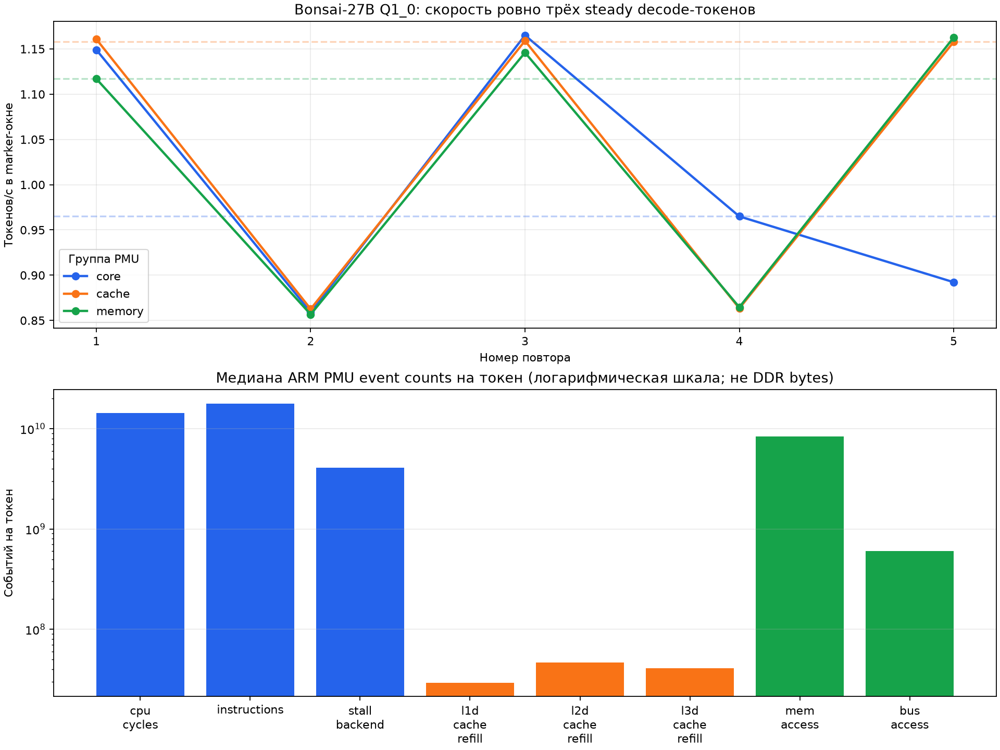

# E049d-v2 — ARM PMU профиль трёх decode-токенов Bonsai

Статус: **ACCEPTED как профиль; это не оптимизация и не end-to-end benchmark**.

E049d-v2 исправляет только границу измерения отклонённого E049d. Для
`llama-completion -n 4` первый generated token появляется после prompt
evaluation, а затем выполняются ровно три `n_tokens == 1` decode graph.
Поэтому окно должно начинаться перед первым из этих трёх graph, без прежнего
`skip first single`.

## Что измерено

- модель: `Bonsai-27B-Q1_0.gguf`;
- один и тот же prompt и параметры E047 во всех запусках;
- ровно три последовательных single-token `graph_compute` внутри каждого
  marker-окна;
- три отдельные группы ARM PMU: `core`, `cache`, `memory`;
- пять свежих повторов каждой группы, всего 15 валидных samples;
- rejected sample E049d и отдельный v2 gate в статистику не включены.

Семантика синхронизации: child пишет `S`, root-parent атомарно включает PMU
group и отвечает `ACK`, после успешного третьего graph child пишет `E`.
`sample_valid=true` требует полный `S → ACK → E`, читаемую температуру,
отсутствие thermal trip, успешный workload и running ratio каждого event не
ниже 0.95.

## Исправление marker и TDD

Host-test сначала воспроизвёл ошибку старого helper: для последовательности
`[prompt, 1, 1, 1]` не было `E`. После удаления skip state machine даёт:

```text
prompt + 3 single decode: measured = [0, 1, 1, 1], S → ACK → E, RC=0
prompt + 2 single decode: measured = [0, 1, 1], S → ACK → EOF, RC=5
```

Второй случай — adversarial test: укороченное окно обязательно отклоняется и
не может случайно выдать `E`. Без `LLAMA_E049D_STEADY_PMU=1` helper по-прежнему
не обращается к fd 8/9.

Target gate с `n=4` прошёл: `status=ok`, `sample_valid=true`, `S/ACK/E=true`,
все running ratios равны 1.0, max 65.162 °C. Generated IDs
`[271, 248068, 198, 8160]` и весь token-capture byte-for-byte совпали со stock,
SHA-256 `12aa19bdb7d3920cc33ffc097ea685539ca85aff060ecdb2f3b2c1cf0af718b5`.

## Настройки

```text
prompt="Explain the A733 memory bottleneck in one short sentence."
ctx=512, batch=512, ubatch=512, n=4, seed=123, temperature=0,
top-k=0, top-p=1, min-p=0, repeat-penalty=1, repeat-last-n=0,
threads=8, threads-batch=8, affinity=0xff, taskset=0-7,
flash-attention=on, mmap=on, ngl=0, KV=f16
```

Build: llama.cpp `38c66ad0241da4f9fcce541cda8edc219086cec5`, Release,
`armv8.2-a+dotprod`, CPU repack и OpenMP включены, native выключен.
Изменён только env-gated marker helper; математические kernels и веса не
изменялись.

## Скорость marker-окна

Это скорость только трёх steady decode graph: без загрузки модели, prompt
evaluation и вывода. Она не равна полной пользовательской скорости запроса.

| Срез | Валидных повторов | Медиана, токен/с | Медиана, с/токен | Max °C |
|---|---:|---:|---:|---:|
| Все samples | 15 | 1.116984 | 0.895268 | 69.856 |
| `core` group | 5 | 0.964963 | 1.036309 | 67.083 |
| `cache` group | 5 | 1.157800 | 0.863707 | 68.853 |
| `memory` group | 5 | 1.116984 | 0.895268 | 69.856 |

Общий диапазон отдельных samples: **0.856698–1.165073 токен/с**. Разные
PMU groups не являются разными оптимизациями: это один бинарник, а группы
запускались последовательно. Поэтому различия их speed-медиан нельзя
приписывать counters или трактовать как ускорение; видимый разброс включает
DVFS, scheduling и прогрев.



## Нормализованные ARM PMU events

Каждое значение ниже — медиана пяти raw counts группы, делённая ровно на три
измеренных токена.

| Event | Медиана event count / токен |
|---|---:|
| `cpu_cycles` | 14,273,863,898.3 |
| `instructions` | 17,769,233,093.0 |
| `stall_backend` | 4,078,927,692.3 |
| `l1d_cache_refill` | 29,395,185.0 |
| `l2d_cache_refill` | 46,759,545.3 |
| `l3d_cache_refill` | 40,997,274.3 |
| `mem_access` | 8,392,801,640.3 |
| `bus_access` | 600,301,887.3 |

Отношение медиан `instructions / cpu_cycles = 1.244879`, а
`stall_backend / cpu_cycles = 0.285762`. Второе число — отношение event
counts, не автоматически «28.6% времени».

`mem_access`, `bus_access` и cache refill — аппаратные **события**, не байты.
Их нельзя умножить на cache-line size и объявить фактическим DDR traffic без
отдельно подтверждённой семантики конкретного PMU A733. Счётчики относятся к
process и наследуемым worker threads.

## Что это говорит о bottleneck

Профиль количественно подтверждает одновременно две нагрузки:

1. большой instruction/cycle объём — на токен приходится около 17.77 млрд
   retired instructions и 14.27 млрд cycles;
2. существенное backend/memory-hierarchy давление — около 4.08 млрд
   `stall_backend`, 41.00 млн L3 refill и 600.30 млн `bus_access` events на
   токен.

Следовательно, Bonsai decode на текущем CPU path нельзя описать как чисто
compute-only. Но этот набор PMU events **ещё не разделяет** время чтения весов
из DRAM и время Q1 unpack/GEMV. Корректный вывод: профиль совместим со
смешанным bottleneck, где memory pressure и вычисление/распаковка сосуществуют;
доминантный вклад пока не доказан. Для разделения нужны контролируемые kernel
microbenchmarks и/или подтверждённый контроллерный счётчик DDR bytes.

E049d-v2 не изменял inference math, поэтому не заявляет ускорение. Значение
выше 1 токен/с здесь — наблюдение внутри узкого steady marker-окна, а не новый
end-to-end результат модели.

## Безопасность и воспроизводимость

- thermal limit каждого запуска: 85 °C, trip не было;
- максимум по 15 samples: 69.856 °C;
- governors до и после: `policy0=ondemand`, `policy6=ondemand`;
- частотные лимиты, OPP, DDR и thermal policy не менялись;
- root использовался только PMU parent; workload сбрасывался к
  `orangepi:orangepi`;
- model payload, пароль, proprietary SDK/NBG в git не добавлены.

Raw каждого gate/run лежит в [`raw/`](raw/), агрегаты — в
[`data/summary.json`](data/summary.json) и [`data/samples.csv`](data/samples.csv).
[`scripts/analyze.py`](scripts/analyze.py) повторно проверяет все safety/data
gates, token parity и строит график. Все опубликованные файлы покрыты
`data/manifest.tsv`.
