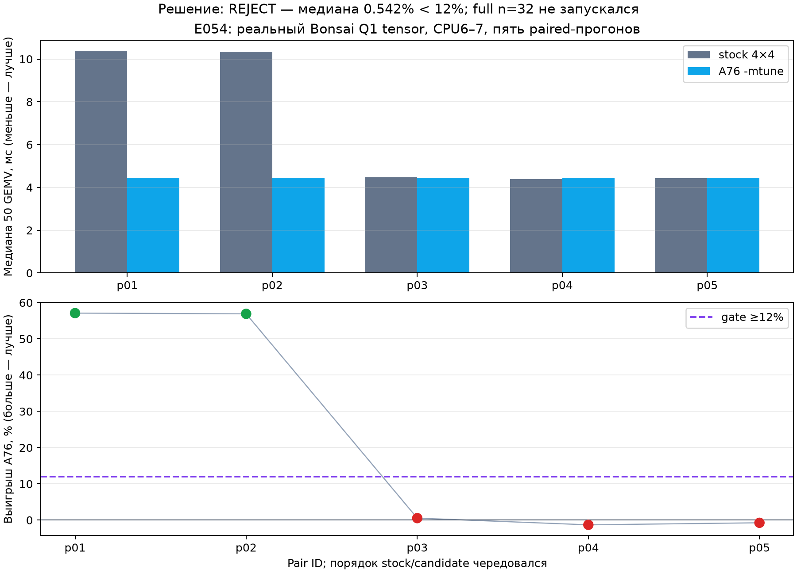

# E054 — multiversion Q1-ядра для Cortex-A76

Дата: 2026-08-14

Плата: Orange Pi Zero 3W / Allwinner A733

Модель: `Bonsai-27B-Q1_0.gguf`

Статус: **REJECTED на микрогейте; полный инференс намеренно не запускался**.

## Короткий итог

Отдельная компиляция неизменённого 4×4 `Q1_0 × Q8_0` ядра под Cortex-A76
не дала требуемого эффекта. По пяти paired-прогонам реального тензора
`blk.0.ffn_gate.weight` медианный выигрыш составил только **+0,542496%** при
заранее установленном gate **≥12%**. Выход F32 и квантованный вход Q8 во всех
десяти запусках совпали побитно.

Поэтому E054 остановлен до полного `Bonsai n=32`: значения токенов/с для этой
ветки **нет**, и сравнивать её с E035 как готовое ускорение нельзя.



SVG: [e054_candidate_microgate.svg](generated/e054_candidate_microgate.svg).

## Что именно проверялось

`Multiversion` здесь означает две машинные версии одной математики:

* `stock` — исходное 4×4 ядро, которым продолжают пользоваться A55;
* `A76` — отдельный translation unit с тем же packed layout и тем же порядком
  `SDOT`/FMA, но с флагом `-mtune=cortex-a76`;
* публичная функция на каждом вызове узнаёт текущий CPU через `sched_getcpu()`
  и выбирает A76-версию только для CPU6 или CPU7;
* `null` выполняет тот же вызов определения CPU, но всегда выбирает `stock`.

Translation unit — отдельно компилируемый `.cpp` файл. `-mtune` не добавляет
новый набор инструкций и не меняет формат весов; он только разрешает GCC иначе
планировать тот же код под микроархитектуру Cortex-A76. `Golden exact` означает
побитовое совпадение артефактов, а не приблизительно близкие logits.

Патч: [0001-a76-q1-multiversion.patch](patches/0001-a76-q1-multiversion.patch),
SHA-256 `c0d51559de8b79a1a0eec3bbbcb2513de6135a9de83d0bccf7867618eab71ed5`.
Он привязан к исходным SHA в [baseline.json](baseline.json).

## Доказательство сборки и dispatch

Изолированные target-каталоги:

```text
/home/orangepi/vip9000-lab/src/e054-a76-q1-multiversion-38c66
/home/orangepi/vip9000-lab/build/e054-a76-q1-multiversion
/home/orangepi/vip9000-lab/build/e054-q1-runner
```

Baseline source/build не изменялись. `nm` обнаружил три разные точки входа:

```text
ggml_gemv_q1_0_4x4_q8_0
ggml_gemv_q1_0_4x4_q8_0_stock(...)
ggml_gemv_q1_0_4x4_q8_0_a76(...)
```

Compile command A76 object содержит ровно
`-mtune=cortex-a76 -fno-lto`. Disassembly публичной функции содержит
`sched_getcpu@plt`, проверку CPU `6..7` и две разные цели перехода.

Артефакты доказательства:

* [nm-libggml-cpu.txt](raw/nm-libggml-cpu.txt);
* [repack-a76-build-command.txt](raw/repack-a76-build-command.txt);
* [objdump-libggml-cpu.txt.gz](raw/objdump-libggml-cpu.txt.gz);
* [build-sha256.txt](raw/build-sha256.txt).

SHA `libggml-cpu.so`:
`a7c52746806c43711f0bf6ffb8f95c9cff87b9f1ab294471f7a4caf0f73b7f29`.

## Host golden

Малый hand-derived fixture имеет `K=128`, `M=16`, scale `0.5` и известный
ответ от `-56` до `64`. На CPU6 режимы `stock`, `null` и `candidate` дали:

```text
F32 SHA-256: 5b045df84161aafd743bd50b1b1358bbcd8b36a1bee571d07849552b04033446
Q8  SHA-256: 69065740893c2429b05ac2e4a556e0ac0028aa4fe18da2bcf011e0bdc8602f0e
```

Все три SHA совпадают. F32 значения совпали с ручным ожиданием с погрешностью
FP16 меньше `0.004`.

## Null dispatch overhead

Каждый вариант исполнил один реальный Bonsai GEMV 50 раз; пять пар
чередовали порядок запуска. CPU affinity `6-7`, `threads=2`, governor
`performance`, частота big-cluster во всех thermal samples `2 002 000 kHz`,
thermal limit 85 °C.

| Pair | stock median, µs | null median, µs | overhead |
|---|---:|---:|---:|
| p01 | 4 376,729 | 11 024,334 | +151,885% |
| p02 | 4 367,792 | 4 458,000 | +2,065% |
| p03 | 10 898,563 | 4 370,896 | -59,895% |
| p04 | 4 386,271 | 4 384,688 | -0,036% |
| p05 | 4 360,876 | 4 368,042 | +0,164% |

Медиана пяти pair-overhead: **+0,164325%**, gate `≤1%` — **PASS**. p01 и
p03 показывают двухрежимный шум целого запуска, а не нагрев: частота оставалась
2,002 ГГц, максимальная температура всех CPU zones была 45,818 °C. Эти пары не
удалялись и входят в медиану.

Вход анализатора: [null-input.json](data/null-input.json); результат:
[null-result.json](data/null-result.json).

## A76 candidate microgate

Условия идентичны null gate. Реальный fixture:

```text
tensor: blk.0.ffn_gate.weight
shape:  [5120, 17408]
Q1 SHA-256: 0f42ca3b81099f540ed67941809ee7fdc0a672563bf852b87db75034135fc6fe
activation SHA-256: 053e8523718a3a6fd9a9d3a3a922a9b82b031a564b8f6886980463b8cd538c52
```

| Pair | stock median, µs | A76 median, µs | выигрыш A76 |
|---|---:|---:|---:|
| p01 | 10 367,291 | 4 447,312 | +57,102% |
| p02 | 10 345,021 | 4 458,312 | +56,904% |
| p03 | 4 474,042 | 4 449,771 | +0,542% |
| p04 | 4 386,770 | 4 443,979 | -1,304% |
| p05 | 4 425,271 | 4 458,021 | -0,740% |

Медиана: **+0,542496%**, gate `≥12%` — **REJECT**. Первые две stock-серии
целиком попали в медленный режим около 10,35 мс. Они не являются доказательством
ускорения A76: три остальные пары находятся около 4,4 мс и дают от `-1,304%`
до `+0,542%`. Частота big-cluster во всех samples была 2,002 ГГц; максимум
CPU zones 46,500 °C, DDR 40,300 °C. Thermal abort отсутствовал.

Golden всех десяти запусков:

```text
F32 SHA-256: 359f62fb43af0150cd2043b26c582e97562aaaf2f8a7134ce34ed144dbf1685f
Q8  SHA-256: 0c72c165dfe0f132870616f777c165421014249d65f8c1183bcc19bbc6fa4f06
```

## Безопасная публикация бинарных capture

Сами `activation.q8_0.bin` и `output.f32.bin` не входят в Git. Это относится
как к 40 артефактам реального тензора Bonsai, так и к шести синтетическим
артефактам: единая консервативная политика исключает случайную публикацию
производных модельных данных. Локальные файлы не удалены.

Для каждого из 46 внешних артефактов опубликованы путь, происхождение, тип,
точный размер и SHA-256 в
[external-sensitive-artifacts.json](data/external-sensitive-artifacts.json).
Поля `published: false` и `retention: local_only` явно показывают, что хеш —
это идентификатор локального capture, а не ссылка на доступный payload.
JSON-метрики, команды, telemetry, stdout/stderr и решения golden сохранены.

Вход анализатора: [candidate-input.json](data/candidate-input.json);
результат: [candidate-result.json](data/candidate-result.json).

## Зафиксированные провалы

Провалы не скрыты и не заменены успешным итогом:

1. `build-attempt-01`: новый TU не включал `simd-mappings.h`, поэтому GCC не
   нашёл `GGML_CPU_FP16_TO_FP32`; exit 2. Добавлен regression test, v2 собран.
2. `fixture-extract`: helper не находился из-за отсутствующего `PYTHONPATH`;
   exit 1.
3. `fixture-extract-02`: extractor корректно отверг output внутри lab repo;
   exit 1. Успешный attempt 03 писал model-derived fixture в `/tmp`.
4. `null-microgate` и `null-microgate-02`: profiler отверг сначала basename
   output dir, затем абсолютный `--phase-file`; оба exit 2. Runner v3 получил
   regression tests и выполнил все десять серий.

Полные stdout/stderr/thermal этих случаев сохранены в [raw](raw/). Список
248 публикуемых raw-файлов и их SHA-256:
[raw-manifest.sha256](data/raw-manifest.sha256). Ещё 46 локальных бинарных
capture перечислены только по хешу и размеру в
[external-sensitive-artifacts.json](data/external-sensitive-artifacts.json).

## Воспроизведение проверки

```bash
python3 tooling/e054_analyze.py \
  --input experiments/E054-a76-q1-multiversion/data/candidate-input.json

MPLCONFIGDIR=/tmp/e054-mpl python3 tooling/e054_plot.py \
  --input experiments/E054-a76-q1-multiversion/data/candidate-result.json \
  --output-prefix /tmp/e054_candidate_microgate

python3 -m unittest tests.test_e054_a76_multiversion -v
```

Точный target workload запускает [run_microgate.sh](run_microgate.sh).
Полный `n=32` gate не выполнялся, потому что microgain <12%; full-график не
создавался.
