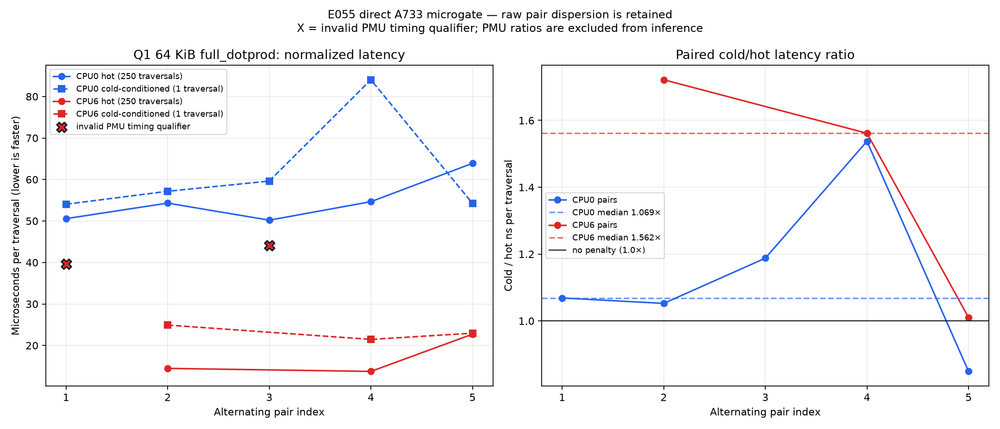

# E055 first direct A733 microgate

Status: **INVALID PHASE — 18 qualified raw samples, 2 invalid raw samples**.

This was a Q1 microbenchmark, not a Bonsai/model run. It used the exact stock
E039 4×4 DOTPROD math and a 64 KiB logical working set on CPU0 and CPU6. The
20 attempted samples are all preserved. The phase may not be promoted or used
as a complete cache-effect estimate because `cpu6-pair1-hot` and
`cpu6-pair3-hot` fail the accepted `T + 1 ms >= H` PMU-window qualifier.

The graph contains real repeated measurements, not a singleton. Its left panel
plots normalized latency for each alternating hot/cold pair; X marks the two
invalid PMU-timing samples. Its right panel contains only complete qualified
pairs and shows cold/hot latency ratios. CPU6 therefore has only three
qualified pairs in the diagnostic panel. These are diagnostics, not a
promotion result.

## What was executed

- Native reproducible GCC/G++ 12 builds compatible with target glibc 2.36;
- exact 18-case stock-kernel golden before measurement;
- CPU0 and CPU6, five alternating pair orders each;
- `full_dotprod`, 64 KiB target / 65,728-byte actual carrier;
- hot: 250 calls after exactly 16 warmups;
- cold-conditioned: one call after verified 64 MiB thrash;
- E049c `core` PMU group, exact ratio 1.0, 85 °C fail-stop;
- direct `/usr/bin/ssh` and `/usr/bin/scp` only.

No helper transport, NPU workload, model, DDR/OPP change, or Bonsai inference
was executed in this phase.

## Results that remain defensible

- 18 samples pass all currently accepted raw qualification rules.
- Maximum observed temperature was 36.890 °C; no thermal gate tripped.
- All 20 harness outputs passed the exact 18-case golden and checksum gates.
- CPU0 retains five complete qualified pairs. Its diagnostic median of
  per-pair cold/hot latency ratios is 1.068742, but dispersion is high
  (0.848958–1.537603), so it is not a strong cache-effect estimate.
- CPU6 retains only three complete qualified pairs. Their diagnostic median is
  1.561661, but this excludes two failed hot samples and must not be generalized.
- PMU count ratios are not kernel-attributable: the cold window contains one
  traversal while the hot window contains 250, leaving fixed S/A/E and launcher
  overhead concentrated in the cold counts. PMU events are not bytes.

The complete 1,260-row promotion matrix was not run. Promotion remains
unconditionally rejected, and no >=4% optimization recommendation follows
from this phase.

## Evidence map

- `raw/`: every exact success and invalid sample stream;
- `analysis.json`: fail-closed derived classification and paired diagnostics;
- `samples.csv`: only the 18 qualified rows;
- `TIMING_ROOT_CAUSE.md` and `timing-comparison.csv`: exact cross-clock
  investigation;
- `build-evidence/native-builds.json`: source/compiler/object/binary/ELF/golden
  provenance for the ABI-compatible native builds;
- `failures/`: both preserved GLIBC 2.38 incompatibility failures;
- `controls/`: two successful root-assisted identity/core controls;
- `raw-manifest.json`: SHA-256 and size binding for all non-generated raw,
  artifact, failure, control, and build-evidence files.
