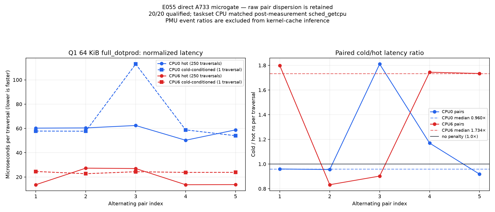

# E055 no-TTY direct A733 microgate

Status: **PASS — 20/20 bounded microgate samples qualified; promotion remains rejected**.

This is a 64 KiB stock-Q1 microkernel experiment, not a Bonsai or token-generation
benchmark. It establishes a trustworthy hot/cold measurement path on CPU0 and CPU6.
It does not establish an end-to-end model speedup.

The left panel shows every measured pair in microseconds per traversal. The right
panel first computes cold/hot for each alternating pair and then plots the five
pair ratios; the dashed lines are medians of pair ratios, never ratios of unrelated
medians. All 20 points passed the exact raw qualifier.

## Exact scope

- exact native harness ELF SHA-256
  `12262831a5527f98426863721ea9fb0c1bb6045bd468124c00675328e8d35f80`;
- exact native E049c ELF SHA-256
  `ebc54b5070985a3668a2811dde8e41997b76ee71c8052fa30642866d28b1a8b4`;
- CPU0 (A55) and CPU6 (A76), five alternating pairs per CPU;
- stock E039 4×4 DOTPROD math, `full_dotprod`, 64 KiB target and 65,728 actual
  carrier bytes;
- hot: 16 warmups followed by exactly 250 traversals;
- cold-conditioned: verified 64 MiB line coverage followed by exactly one traversal;
- E049c `core` group, exact `running_ratio=1.0`, S/A/E synchronization, 85 °C
  fail-stop;
- installed `/usr/bin/ssh -T` and `/usr/bin/scp` only. A local echo-disabled PTY
  carried the interactive sudo input; the board received no SSH TTY;
- requested affinity came from `taskset -c N`. The harness omitted `--cpu`, so its
  `cpu` field is the post-measurement `sched_getcpu()` observation. All 20 reported
  the requested CPU.

The preceding phase incorrectly passed `--cpu N`; its field was only a caller label
and makes no migration claim. This phase corrects metadata only. It does not change
the executable, kernel math, layout, working set, traversal count, or timing region.

## Qualification result

Every sample passed all of these gates before the next sample started:

- exact five raw roles and zero-byte wrapper stdout, wrapper stderr, and child stderr;
- E049c status `ok`, `sample_valid=true`, exact three-event `core` group and ratio 1;
- positive harness `H`, parent `M`, and perf `T/R`, with `M+1 ms>=H`, `T+1 ms>=H`,
  and `T=R`;
- exact S/A/E markers, clean child exit and process-tree cleanup;
- readable thermal telemetry with no trip; maximum observed temperature was
  **39.618 °C**;
- exact 18-case golden, hot checksum `0xea018b4296d17e54`, cold checksum
  `0xf0d4224634da5da3`, and conditioning checksum gates;
- observed CPU equal to requested CPU.

## Normalized results

| CPU | Median hot | Median cold-conditioned | Median paired cold/hot | Qualified pairs |
|---|---:|---:|---:|---:|
| CPU0 / A55 | 60.249 µs, 16,598 traversals/s | 57.833 µs, 17,291 traversals/s | 0.960× | 5/5 |
| CPU6 / A76 | 13.745 µs, 72,753 traversals/s | 23.833 µs, 41,959 traversals/s | 1.734× | 5/5 |

For the hot repeated traversal, CPU6 is 4.38× faster than CPU0 at this 65,728-byte
carrier size. Under the one-traversal cold conditioning protocol it is 2.43× faster.

These medians need careful interpretation. CPU0 pair ratios range from 0.918× to
1.810×, so there is no stable CPU0 cold penalty. CPU6 pair ratios are also bimodal:
0.832×, 0.902×, 1.734×, 1.744×, and 1.798×. The CPU6 hot points themselves split
between about 13.6 µs and 27.3 µs. No per-sample frequency trace was captured, so
that split cannot be attributed to cache conditioning alone. The result supports a
future task-clock/context-switch/frequency diagnostic, not a cache-only optimization
claim.

Raw PMU event-count ratios are retained but excluded from kernel-cache inference.
Cold has one measured traversal while hot has 250, so fixed marker/launcher/counter
overhead is concentrated in the cold counts. PMU events are counts, never bytes.

## Promotion decision

Promotion is unconditionally false. This phase supplies 20 qualified rows for only
one of the required 126 phase cells; the full promotion contract requires 1,260 rows.
It therefore does not cross the documented >=4% optimization gate and does not
authorize a full Bonsai run.

## Evidence map

- `raw/`: 100 exact files for the 20 qualified runs;
- `samples.csv`: all 20 analyzer-derived normalized rows;
- `analysis.json`: paired statistics and the fail-closed promotion result;
- `e055-paired-hot-cold.png`: meaningful repeated-pair chart;
- `controls/identity-core/`: passing root-assisted uid1000 core-PMU control;
- `controls/harness-pmu-gate/`: passing non-dataset no-TTY live gate;
- `build-evidence/native-builds.json`: source/compiler/object/ELF provenance;
- `artifacts/`: the exact native PMU and Q1 harness executables;
- `raw-manifest.json`: SHA-256 and byte-size binding for all raw/control/build/artifact
  evidence.

No model, NPU, DDR/OPP change, or token-generation workload ran.
